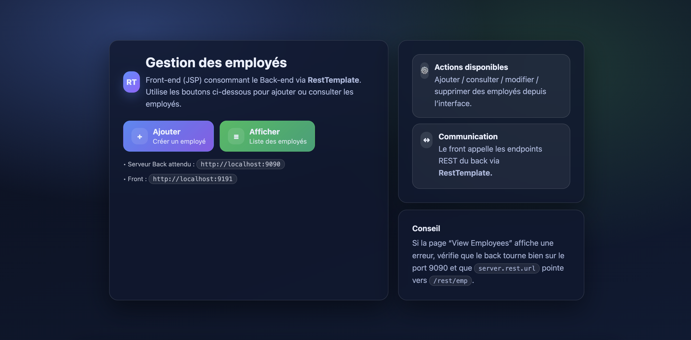
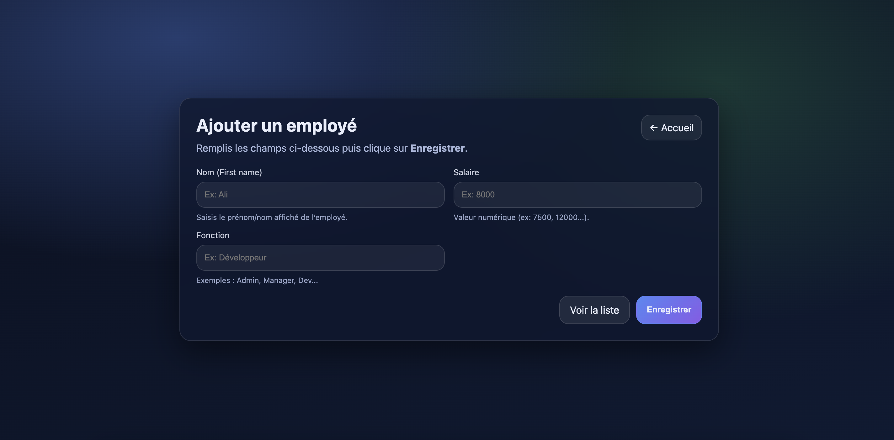
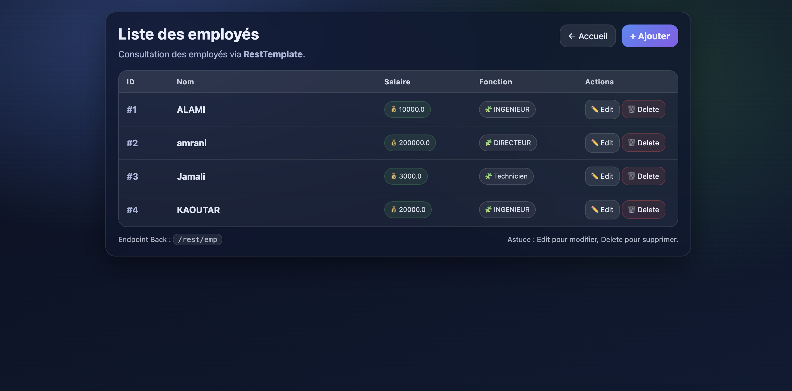

# TP 6.2 — RestTemplate (Front-end JSP + Back-end REST) — Spring Boot


Projet du **TP 6.2** : une application composée de **deux modules** :

- **Back-end (REST)** : expose des endpoints CRUD pour gérer des employés (H2 + JPA).
- **Front-end (JSP)** : consomme le back-end via **RestTemplate** (pages JSP : ajout, liste, édition, suppression).

---

## 📌 Sommaire

1. [Fonctionnalités](#-fonctionnalités)
2. [Stack technique](#-stack-technique)
3. [Architecture](#-architecture)
4. [Démarrage rapide](#-démarrage-rapide)
    - [Prérequis](#1-prérequis)
    - [Lancer le Back-end](#2-lancer-le-back-end)
    - [Lancer le Front-end](#3-lancer-le-front-end)
5. [Endpoints REST (Back)](#-endpoints-rest-back)
6. [Aperçu](#-aperçu)
7. [Auteurs](#-auteurs)
8. [Licence](#-licence)

---

## ✅ Fonctionnalités

### Back-end (REST)
- CRUD employés : **Create / Read / Update / Delete**
- Pagination / tri (selon le TP)
- Base **H2 en mémoire**
- Exposition JSON (et XML si activé via Jackson XML)

### Front-end (JSP)
- Page d’accueil
- Ajouter un employé
- Lister les employés
- Modifier un employé
- Supprimer un employé
- Consommation des endpoints via **RestTemplate**

---

## 🛠️ Stack technique

| Technologie | Version |
|-----------|---------|
| Java | 17 |
| Spring Boot | 3.3.6 |
| Maven | ✅ |
| Spring Web | ✅ |
| Spring Data JPA | ✅ |
| H2 Database | ✅ |
| JSP + JSTL + Jasper (Front) | ✅ |
| ModelMapper (Back) | ✅ |

---

## 🏗️ Architecture

```
TP6-2-RestTemplate/
├─ resttemplate-back/ # Back-end REST (port 9090)
│ ├─ src/main/java/...
│ └─ src/main/resources/...
└─ resttemplate-front/ # Front-end JSP (port 9191)
├─ src/main/java/...
└─ src/main/webapp/vues/...
```

### Packages (exemple)
```
ma.resttemplate.spring.rest
├─ controller/ (Front MVC Controller)
├─ controller/rest/ (Back REST Controller)
├─ dao/ (Repository)
├─ domaine/ (EmpVo DTO)
├─ service/ (Service + Impl)
├─ service/modele/ (Entity Emp)
└─ config/ (ModelMapperConfig)
```

---

## 🚀 Démarrage rapide

### 1️⃣ Prérequis

✅ Java **17**  
✅ Maven (ou Maven Wrapper si ajouté)  
✅ IntelliJ IDEA / VS Code (au choix)


### 2️⃣ Lancer le Back-end

Accède au dossier :

```
cd resttemplate-back
```

Lancer :

```
mvn spring-boot:run
```

➡️ Back-end dispo sur : http://localhost:9090 <br/>
✅ Console H2 :
http://localhost:9090/h2-console <br/>
(JDBC URL par défaut : jdbc:h2:mem:testdb)

### 3️⃣ Lancer le Front-end

Dans un autre terminal :

```
cd resttemplate-front
mvn spring-boot:run
```
➡️ Front-end dispo sur : http://localhost:9191

## 🔗 Endpoints REST (Back)

Base URL :
http://localhost:9090/rest/emp

| Méthode | Endpoint                         | Description                   |
| ------- | -------------------------------- | ----------------------------- |
| GET     | `/rest/emp`                      | Liste des employés            |
| GET     | `/rest/emp/id/{id}`              | Employé par ID                |
| GET     | `/rest/emp/name/{name}`          | Employés par nom              |
| POST    | `/rest/emp`                      | Ajouter un employé            |
| PUT     | `/rest/emp/{id}`                 | Modifier un employé           |
| DELETE  | `/rest/emp/{id}`                 | Supprimer un employé          |
| DELETE  | `/rest/emp`                      | Supprimer tous les employés   |
| GET     | `/rest/pagination/{page}/{size}` | Pagination                    |
| GET     | `/rest/sort/...`                 | Tri (selon implémentation TP) |

---

## 👀 Aperçu 


| /                 | /empform   | /viewemp           |
|-----------------------|-------------------|--------------------|
|  |  |  | 

Exemple de workflow

1. Ouvrir : http://localhost:9191 et http://localhost:9090
2. Add Employee → Save
3. View Employees → Edit / Delete

---

## 👥 Auteurs 

Anas KRIR — Implémentation & intégration du Back <br/>
Adam EL YOURI — Collaboration / UI & intégration du Front

---

## 📄 Licence

Projet sous licence MIT.<br/>
✅ Libre d’utiliser, modifier, distribuer.

© 2025 — KRIR Anas & EL YOURI Adam

---
